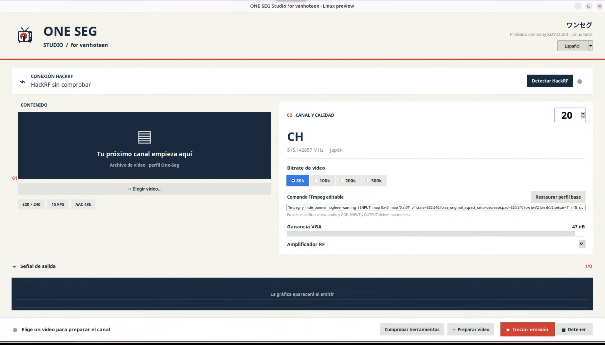

# ONE SEG Studio for Linux

## 🌐 Elige tu idioma

### [🇬🇧 English](README.md)
### [🇪🇸 Castellano](README.es.md)
### [ Asturianu](README.ast.md)
### [🇩🇪 Deutsch](README.de.md)
### [ Català](README.ca.md)

---


> **VERSIÓN EXPERIMENTAL DE PRUEBAS — Ubuntu 26.04 LTS · amd64 (Intel/AMD de 64 bits). No es una versión estable.**

Proyecto creado por **vanhoteen** para preparar vídeo y generar una señal de televisión japonesa One-Seg con un HackRF One. En la configuración habitual de ISDB-T, uno de los trece segmentos —el central— lleva televisión de menor resolución para pequeños receptores, sin Internet.

## Interfaz

ONE SEG Studio para Linux incluye interfaz en **castellano e inglés**. El selector cambia toda la aplicación, incluidos la preparación, la detección del HackRF, los controles de emisión y los mensajes de estado.



## Prueba realizada

El autor ha compilado e instalado esta versión en Ubuntu 26.04 amd64 y ha confirmado la recepción en una Sony XDV-D500. También han pasado las comprobaciones de preparación de vídeo H.264 320×240, audio AAC y paquetes TS, sin errores de continuidad. Esto no constituye una certificación de la norma ni garantiza todos los receptores.

## Descargar e instalar

[Releases — descargas del instalador](https://github.com/vanhoteen/ONE-SEG-Studio-for-Linux/releases)

Descarga [**ONE-SEG-Studio-Linux-preview6-Ubuntu26-amd64.zip de la versión 0.3**](https://github.com/vanhoteen/ONE-SEG-Studio-for-Linux/releases/download/0.3/ONE-SEG-Studio-Linux-preview6-Ubuntu26-amd64.zip). Los archivos automáticos **Source code** de GitHub son el código para compilar, no el instalador.

Descarga y descomprime la **carpeta completa del instalador**. Conserva juntos los dos `.deb`, `INSTALL.sh`, `UBUNTU_VERSION` y `SHA256SUMS`. Abre una terminal en esa carpeta y ejecuta:

```bash
bash INSTALL.sh
```

Introduce la contraseña de administrador y espera. Se comprueban los paquetes y se instalan ONE SEG Studio, TSDuck y las dependencias de Ubuntu: GNU Radio, FFmpeg, Python y soporte para HackRF. **Necesita Internet; no hay que compilar en el ordenador de destino.** Reutiliza las dependencias existentes. No es un paquete autónomo como el DMG de Mac.

## Edición para ordenadores con pocos recursos — I/Q sin conexión

> **Versión de prueba opcional y separada.** Si la edición Linux normal muestra vídeo intermitente, fotogramas negros o ausencia de señal en un ordenador poco potente, prueba la [edición I/Q sin conexión](https://github.com/vanhoteen/ONE-SEG-Studio-for-Linux/releases/tag/offline-iq-test-0.1). Genera el archivo I/Q completo **antes** de abrir el HackRF. Al emitir, el HackRF reproduce ese archivo ya preparado, con menos trabajo de CPU en tiempo real y sin pausas de modulación durante la salida RF. La preparación tarda más y necesita espacio libre en disco; está pensada para experimentar, no como versión predeterminada.
>
> Esta edición también conserva el **comando FFmpeg editable** para experimentar con vídeo, audio, GOP y MPEG-TS. Al editarlo, conserva `INPUT`, el marcador final `OUTPUT` y el formato de salida `mpegts`.
>
> Descarga [el ZIP instalador I/Q sin conexión](https://github.com/vanhoteen/ONE-SEG-Studio-for-Linux/releases/download/offline-iq-test-0.1/ONE-SEG-Studio-offline-iq-preview7-Ubuntu26-amd64.zip), descomprímelo, entra en `linux-ubuntu26-amd64`, ejecuta `sha256sum -c SHA256SUMS` y después `bash INSTALL.sh`. Sustituye temporalmente la aplicación normal instalada y aparecerá como ONE SEG Studio en Aplicaciones; reinstala después la versión normal si quieres volver a ella.

## Controles experimentales del codificador y registros

La vista previa Linux muestra el **comando FFmpeg completo y editable** para experimentar con receptores. Su perfil base que funciona es `320×240`, `15 fps`, H.264 Baseline nivel 1.2, `-g 15 -bf 0 -refs 1`, cabeceras repetidas, AAC 24 kHz / 48 kb/s y los ajustes de transporte One-Seg. El usuario puede modificar argumentos de vídeo, audio, GOP y TS antes de preparar. Deben conservarse el marcador `INPUT`, el marcador final `OUTPUT` y el formato de salida `mpegts`. Cada operación también guarda un registro en `~/.local/share/one-seg-studio/logs/`.

Abre **ONE SEG Studio** desde el menú de aplicaciones del escritorio Linux. Una sesión SSH sin escritorio gráfico no muestra la ventana.

## Primer uso

1. Conecta el HackRF por USB.
2. Pulsa **Check tools** y **Detect HackRF**.
3. Elige vídeo, canal, bitrate y ganancia.
4. Pulsa **Prepare video** y espera.
5. **Transmit** inicia RF y **Stop** la detiene. Instalar y preparar no transmite.

Vídeo 320×240 a 15 fps; 80, 100, 200 o 300 kb/s; AAC a 48 kb/s. El amplificador RF empieza activado y la ganancia VGA inicial es de 47 dB. Cambiar parámetros exige preparar de nuevo.

## Límites del modelo de pruebas

Interfaz Linux disponible en castellano e inglés. Otras distribuciones y arquitecturas sin verificar. Reproducción finita, sin bucle continuo garantizado. No incluye cámara, capturadora ni gráfica integrada; un mensaje heredado del motor puede mencionar una gráfica que esta interfaz no muestra. Las tablas horarias son una instantánea del momento de preparación. Archivos de trabajo en `~/.local/share/one-seg-studio`.

## Responsabilidad al emitir

Comprueba las normas de frecuencia, potencia y autorizaciones de tu país. Un canal japonés no autoriza a usar esa frecuencia fuera de Japón. Utiliza una prueba conducida o apantallada cuando corresponda y evita interferencias perjudiciales. El usuario es responsable de los permisos, la configuración y el uso de su equipo. Este proyecto educativo no concede permiso de emisión. En la medida permitida por la ley, el autor no asume responsabilidad por usos no autorizados o interferencias causadas por el usuario.

## Compilar

Ejecuta `bash linux/build-deb.sh --install-deps` en el Ubuntu de destino. Genera ISDB-T compilado y el instalador, con una prueba de preparación sin RF. El script contempla Ubuntu 24.04 y 26.04, pero **solo 26.04 amd64 está probado por el autor**. Consulta las [notas de compilación](linux/README.md) y [licencias](LICENSE-NOTICE.md).

## Demo · One-Seg

[](https://youtu.be/hW7jU8Ro0uk)

[macOS project](https://github.com/vanhoteen/ONE-SEG-Studio-)
